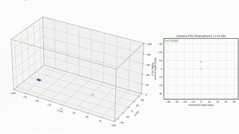
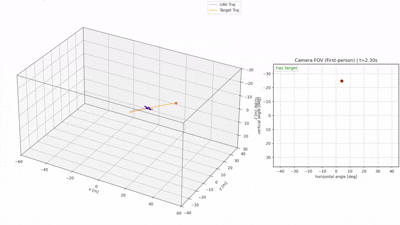
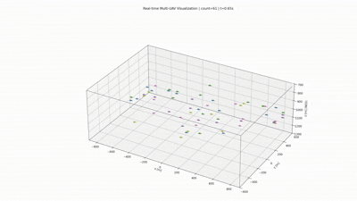

# IBVS Interception Simulation Framework

> A modular UAV interception simulation framework for control, dynamics, sensing, and visualization experiments.

# 0. Run Simulation

## Python Environment

Recommended environment (Conda):

```bash
# 1) Create environment
conda create -y -n SimpleDroneSim python=3.11 numpy pyyaml matplotlib

# 2) Activate
conda activate SimpleDroneSim

# 3) Install project in editable mode
python -m pip install -e .

# 4) Optional: install Qt backend for interactive windows
conda install -y pyqt
python -c "import matplotlib; print(matplotlib.get_backend())"
```

If the visualization window does not appear, try:

```bash
export MPLBACKEND=QtAgg
```

## Run Rules

- After `python -m pip install -e .`, you can run scripts directly from the repository root.
- Most scripts automatically search for a same-name YAML config in [configs](configs).
- Therefore `--config` is optional in normal usage.
- Multi-UAV trajectory following additionally requires a CSV file.

## Quick Start

```bash
python scripts/ibvs_ctrl_sim.py
python scripts/ibvs_so3_ctrl_sim.py
python scripts/pos_ctrl_sim.py
python scripts/rate_ctrl_sim.py
```

## Demos

### 1) IBVS interception demo

Related paper: 【2020 ICRA】An Autonomous Intercept Drone with Image-based Visual Servo

```bash
python scripts/ibvs_ctrl_sim.py
```

Use an explicit config if needed:

```bash
python scripts/ibvs_ctrl_sim.py --config configs/ibvs_ctrl.yaml
```



### 2) High-speed IBVS-SO3 interception demo

Related paper: 【2025 TCST】High-Speed Interception Muticopter Control by Image-based Visual Servoing

```bash
python scripts/ibvs_so3_ctrl_sim.py # TODO
```

### 3) PX4-like position control demo

```bash
python scripts/pos_ctrl_sim.py
```

Optional arguments:

```bash
python scripts/pos_ctrl_sim.py --p-sp 20 10 -30 --yaw-sp 0.0 --t-final 20
```



### 4) Rate control demo

```bash
python scripts/rate_ctrl_sim.py
```

### 5) Multi-UAV trajectory following demo

```bash
python scripts/multi_pos_ctrl_sim.py --csv configs/multi_pos_ctrl_data/multi_pos_ctrl_data.csv
```

Use an explicit config if needed:

```bash
python scripts/multi_pos_ctrl_sim.py --config configs/multi_pos_ctrl.yaml --csv configs/multi_pos_ctrl_data/multi_pos_ctrl_data.csv
```



## Visualization Notes

- Real-time 3D rendering based on `matplotlib` can be slow for many UAVs or very long trajectories.
- For smoother runs, lower `visualization_hz`, reduce `trail_len`, or disable real-time animation and use offline replay.
- Offline replay cache is controlled by `visualization.save_cache` in the YAML config.

# 1. Project Vision

This project aims to build a UAV interception simulation framework with the following properties:

* Same controller/estimator code can be reused across different implementations
* Physics and sensor realism can be gradually extended
* Designed for research-grade reproducibility and extensibility
* Modular, testable, and configuration-driven

---

We currently focus on building a practical baseline with a clear path for extension.

# 2. Features

* 6DoF rigid-body UAV dynamics
  * Position, velocity
  * Quaternion attitude
  * Body angular-rate dynamics with inertia
* Motor and rotor chain
  * High-level force / rate command tracking
  * Allocation from body wrench targets to four motor current commands
  * Motor dynamics and rotor-generated thrust / yaw torque
* Target simulation
  * Point-mass target motion
* Camera model
  * Pinhole projection
  * Image-plane target visualization
  * Field-of-view checking
* Observation pipeline
  * Perfect self-state access
  * Relative position / velocity generation
* Control stack
  * Task-level IBVS / interception controller
  * PX4-like cascaded basic control stack in progress
* Multi-rate scheduler
  * Physics integration
  * Control loop
  * Camera frame rate
  * Visualization update rate
* Visualization
  * 3D world-view animation
  * UAV body attitude visualization
  * First-person camera FOV view
* Logging and replay
  * NPZ-based run logging
  * Offline visualization scripts

# 3. Future

* Sensor delay, noise, dropout, and bias models
* Wind field model
* Rotor drag, flapping, and richer aerodynamic effects
* Better actuator and ESC models
* Delayed Kalman Filter (DKF) and estimator integration
* Monte Carlo evaluation and CEP-style metrics

# 4. Project Structure

```html
ibvs_sim/
│
├── configs/
│   └── ibvs_so3_ctrl.yaml
│
├── sim/
│   ├── simulator.py        # multi-rate main loop
│   └── scheduler.py        # time triggers
│
├── models/
│   ├── state.py
│   ├── rigid_body.py       # 6DoF dynamics
│   └── target.py
│
├── sensors/
│   └── camera.py           # projection + FOV
│
├── control/
│   ├── controller_base.py
│   └── ibvs_so3_controller.py
│
├── observe/
│   └── perfect.py
│
├── utils/
│   ├── math3d.py
│   ├── metrics.py
│   └── log.py
│
├── visualization/
│   ├── animate_3d.py
│   ├── plot_traj.py
│   ├── viz_latest.py
│   └── npz_replay/
│       ├── __init__.py
│       ├── animate_3d.py
│       ├── plot_traj.py
│       └── viz_latest.py
└── scripts/
    └── ibvs_ctrl_sim.py
```

# 5.  Control Structure

## Code Structure

```
control/
├── controller_base.py
├── ibvs_so3_controller.py      # Current task-level IBVS controller
├── basic_control/
│   ├── setpoints.py            # Position/Velocity/Attitude/Rate setpoints
│   ├── position_controller.py  # Position -> Velocity
│   ├── velocity_controller.py  # Velocity -> Attitude + Thrust
│   ├── attitude_controller.py  # Attitude -> Rate + Thrust
│   ├── rate_controller.py      # Rate + Thrust -> ForceSetpoint
│   ├── basic_controller.py     # Setpoint routing + cascade + allocation entry
│   └── utils.py                # Saturations, anti-windup helpers, common math
```

**Current implementation:** `ibvs_so3_controller.py` still outputs `ControlCommand(thrust, omega_cmd_b)` directly, while `basic_control/basic_controller.py` now owns the reusable low-level cascade and motor allocation path.

**Target design rule:** advanced controllers should produce *setpoints* only. `basic_control` should be the reusable PX4-like autopilot stack that tracks setpoints and outputs the low-level motor command pipeline:

`Position -> Velocity -> Attitude -> Rate -> ForceSetpoint -> Allocation -> MotorCommand`

---

## Interface Definitions

### 1) Setpoint protocol (in `control/basic_control/setpoints.py`)

Define a small set of typed setpoints used to connect layers:

* **PositionSetpoint**
  * `p_sp_e: (3,)` position in **NED**
  * `yaw_sp: float` (optional)
* **VelocitySetpoint**
  * `v_sp_e: (3,)` velocity in **NED**
  * `yaw_sp: float` (optional)
* **AttThrustSetpoint**
  * `q_sp_eb: (4,)` desired attitude quaternion ( **body→world** , scalar-first)
  * `thrust_sp: float` (N)
* **RateThrustSetpoint**
  * `omega_sp_b: (3,)` desired body rates in **FRD**
  * `thrust_sp: float` (N)

These setpoints are  *control targets* , not states.

### 2) Low-level control interfaces (in `models/state.py`)

* **ForceSetpoint**
  * `thrust_sp: float`
  * `tau_sp_b: (3,)` desired body torque in **FRD**
* **MotorCommand**
  * `motor_current_cmd: (4,)`
  * This is the executable actuator command consumed by the motor model

### 3) Basic control routing API (in `control/basic_control/basic_controller.py`)

Use an enum-like mode selector:

* `CTRL_MODE.POSITION`
* `CTRL_MODE.VELOCITY`
* `CTRL_MODE.ATT_THRUST`
* `CTRL_MODE.RATE_THRUST`

BasicController routing interface:

* `update_setpoint(sp)` — accept one of the setpoint types above
* `step(uav_state, obs, t_now) -> MotorCommand`

**Contract:** regardless of input mode, the final executable output is always `MotorCommand`.

### 4) Advanced controllers API

Current file:

* `control/ibvs_so3_controller.py`

Target behavior:

* advanced controllers (IBVS, interception, etc.) should output **one of the setpoints**, preferably:
* **AttThrustSetpoint** (PX4-like integration), or
* **RateThrustSetpoint** (direct rate interface)

Recommended IBVS output: `AttThrustSetpoint(q_sp_eb, thrust_sp)` because the paper naturally computes `R_d` and `f_d`.

---

## Functional Implementation & Usage

### A) Functional pipeline (PX4-style)

Current executable path in the simulator:

`IBVSSO3Controller -> ControlCommand -> BasicController -> ForceSetpoint -> MotorCommand -> Motors -> RigidBody6DoF`

Target PX4-like path after advanced-control refactor:

`AdvancedController -> Setpoint -> BasicController -> Position/Velocity/Attitude/Rate -> ForceSetpoint -> Allocation -> MotorCommand -> Motors -> RigidBody6DoF`

### B) Module responsibilities (what each file should do)

**`position_controller.py`**

* Input: `UAVState`, `PositionSetpoint`
* Output: `VelocitySetpoint`
* Typical: `v_sp = sat(Kp*(p_sp - p), v_max)` (+ optional yaw logic)

**`velocity_controller.py`**

* Input: `UAVState`, `VelocitySetpoint`
* Output: `AttThrustSetpoint`
* Typical PX4-style logic:
  * `a_sp = Kp*(v_sp - v)`
  * `thrust_vector_e = m*(a_sp - g_e)`
  * `thrust_sp = ||thrust_vector_e||`
  * `q_sp` chosen so body thrust axis aligns with `thrust_vector_e` (body -z to thrust_vector)

**`attitude_controller.py`**

* Input: `UAVState`, `AttThrustSetpoint`
* Output: `RateThrustSetpoint`
* SO(3) attitude error:
  * `e_R = vex(R_sp^T R - R^T R_sp)`
  * `omega_sp = -K_R * e_R` (sign depends on your convention; keep consistent)
  * pass through `thrust_sp`

**`rate_controller.py`**

* Input: `UAVState`, `RateThrustSetpoint`
* Output: `ForceSetpoint`
* Typical:
  * `tau_sp = Kp*(omega_sp - omega) + Ki*... + Kd*...`
  * pass through `thrust_sp`

**`basic_controller.py`**

* Own mode routing for `Position/Velocity/Attitude/Rate` setpoints
* Run the cascade down to `RateThrustSetpoint`
* Internally perform control allocation from `ForceSetpoint` to `MotorCommand`
* Transitional compatibility: still accepts legacy `ControlCommand`
* Output: `MotorCommand`

**`ibvs_so3_controller.py`**

* output setpoints only

### C) How to use it in the simulator
